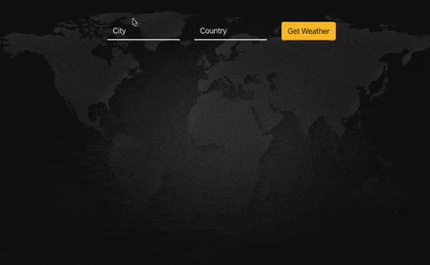

This project was bootstrapped with [Create React App](https://github.com/facebook/create-react-app).

## Weather app built in React

## Demo

Open Project directory and type:-
### `npm install`

This command will download all the dependacy in the project. After that just start the server using following command.

In the project directory, you can run:

### `npm start`

Runs the app in the development mode. 
Open [http://localhost:3000](http://localhost:3000) to view it in the browser.

The page will reload if you make edits. 
You will also see any lint errors in the console.

